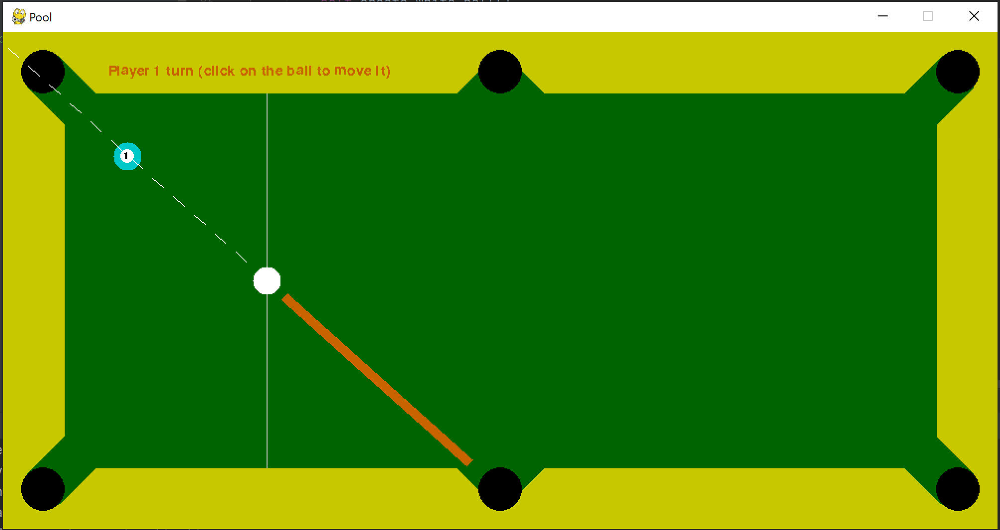
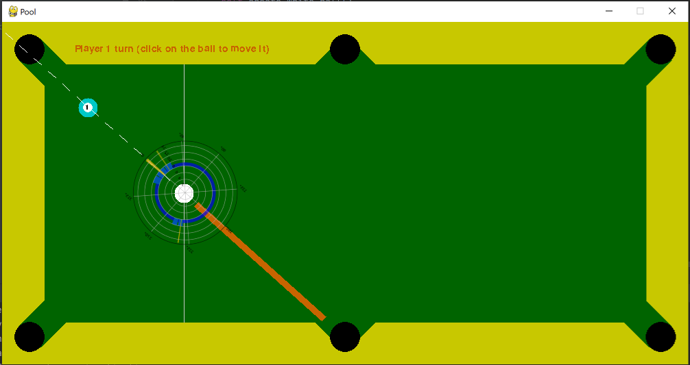

# gym-pool
A gym environment for the OpenAi gym. Make RL competitive again.
This repository inlcudes a novel gym environemnt for the game of pool (in a simplified one player version). It is based on previous work of https://github.com/nkatz565/CS229-pool and https://github.com/max-kov/pool. 

The currently avilable enviornemnts are:

- Pool_v0 - a classical one player envornment with a scalable number of balls (reward for putting is 5 punishment for missing any ball is -1). State space are ball coordiantes.
- Pool_v1 - a version with new statesoace (using angle and distance informatio between all bals and the holes in the table). Values are discretized.
- Pool_continuous_v0 - a continous version of the state space above.
- Pool_angle_v0 - a version with a state space including only angle but no distance inforamtion. Can be used as a sort of ablation study for a given algorithm.

With https://github.com/to314as/gym-pool-algorithms we provide an initial benchmarkable selection of RL algorithms. We hope we can inspire further research.

